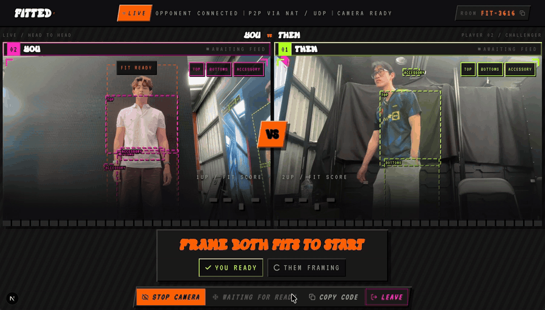

# FITTED

**An Omegle-style app for head-to-head outfit battles.**

FITTED is a two-player web app for live outfit comparisons. One player creates a
room and shares its code. Once both players are connected and in frame, the app
runs a five-second round, displays live scores, and returns a final comparison.

The project was built for the UQCS Hackathon in August 2026.

<p align="center">
  
</p>

## Features

- Two-player rooms accessed through shareable room codes
- WebRTC video with direct, NAT-traversed, and TURN-relayed connections
- Browser-based pose detection and outfit framing checks
- Synchronized five-second rounds with live DINOv2 scores
- Optional RF-DETR garment detection
- Final Gemini comparisons scored on component quality, coordination, and fit
- Rematches and a leaderboard that records wins and highest scores

## How it works

The Next.js application provides the interface, while Socket.IO handles room
membership, WebRTC signalling, readiness, and round timing. MediaPipe selects
stable outfit crops in the browser. WebRTC carries the video stream directly when
possible and uses TURN when a relay is required.

Selected crops are sent to the FastAPI service. A DINOv2 ranker produces the live
scores, RF-DETR can identify garment categories, and Gemini performs the final
comparison.

## Tech stack

Next.js, React, TypeScript, Tailwind CSS, Socket.IO, WebRTC, FastAPI, PyTorch,
DINOv2, RF-DETR, MediaPipe, and Gemini.

## Getting started

Requirements:

- Node.js 22 or later
- Python 3.11 or later

Clone the repository, install the dependencies, and start both services:

```bash
git clone https://github.com/wyqfrank/fitted.git
cd fitted
npm run setup
npm run dev
```

Once started:

- Web app: [http://localhost:3000](http://localhost:3000)
- Inference API: [http://localhost:8000](http://localhost:8000)
- OpenAPI documentation: [http://localhost:8000/docs](http://localhost:8000/docs)

Run either service on its own with `npm run dev:web` or `npm run dev:api`.

### Gemini scoring

To enable final comparisons, copy the inference environment file and add a Gemini
API key:

```powershell
Copy-Item services/inference/.env.example .env
```

```dotenv
GEMINI_API_KEY=your-key
FITTED_SCORING_BACKEND=vlm_fallback
```

The application can run without these values, but final comparisons will be
unavailable.

### Optional local models

Install the ML dependencies to enable the local DINOv2 ranker:

```bash
node scripts/python.mjs -m pip install -e "services/inference[dev,ml,vlm]"
```

RF-DETR requires an additional checkpoint and a compatible PyTorch installation.
See the [inference service guide](services/inference/README.md) for setup details.

## Running on two devices

Browsers require a secure context before they allow camera access. `localhost`
works for local development, but a second device must use HTTPS. Start the
application and expose it through an HTTPS tunnel:

```bash
npm run dev
cloudflared tunnel --url http://localhost:3000
```

Open the generated URL on both devices. If the network blocks a direct WebRTC
connection, configure a TURN relay using `apps/web/.env.example`. The
`/diagnostics` page reports the available connection routes.

## Project structure

```text
apps/web/             Next.js app, signalling server, and WebRTC client
services/inference/   FastAPI service and model code
models/               Shipped model artifacts
docs/                 Product notes, specifications, and experiments
scripts/              Development and setup scripts
```

## Checks

```bash
npm run check
```

This command runs TypeScript checks, web and API tests, Python linting, and a
production build.

## Documentation

- [Product requirements](docs/PRD.md)
- [Inference service](services/inference/README.md)
- [Ranker evaluation](docs/ranker-audit.md)
- [Labelling workflow](docs/labelling-station.md)

## License

The source code is available under the [MIT License](LICENSE).

The shipped ranker was trained partly on Fashion144k images, which are restricted
to non-commercial research and education. Third-party models retain their own
licenses.
